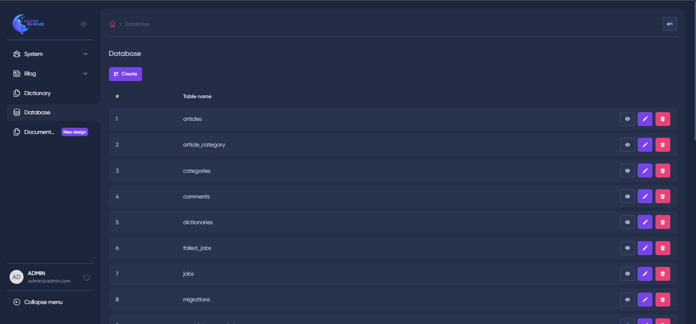

## Moonshine Database

### Description

The Moonshine Database Manager package is a powerful extension for the Moonshine Admin Panel that facilitates seamless
database management directly from the admin interface. This Laravel package enhances the functionality of the Moonshine
Admin Panel by allowing administrators to effortlessly interact with the underlying database without the need for
complex SQL queries or external tools.

---

## Features

- [x] __Intuitive Interface__: The package integrates seamlessly with the Moonshine Admin Panel, providing a
  user-friendly interface to manage databases. Administrators can perform CRUD (Create, Read, Update, Delete) operations
  on database records effortlessly.
- [x] __User Permissions__: Control access to the database manager with robust user permission settings. Define which
  administrators can view, edit, or delete database records and tables.
- [X] __Easy Installation__: The package is easy to install and configure.

---

## Installation

1. Install the package via composer:

    ```bash
    composer require sweet1s/moonshine-database
    ```

2. Publish the configuration file:

    ```bash
    php artisan vendor:publish --provider="Sweet1s\MoonShineDatabase\Providers\MoonShineDatabaseServiceProvider" --tag="config"
    ```

3. Add the item to your MoonShineServiceProvider file, like this:
    ```php
    \Sweet1s\MoonShineDatabase\Menu\Database::make()
    ```

---

## Authentication

To utilize authentication, Moonshine Database relies on the __Laravel Gate system__. To enable this functionality, you
need to add the following code to your AuthServiceProvider and implement your own authorization logic. First, you should
set the auth parameter to true in the moonshine-database.php configuration file. Here's an example code snippet:

In your config/moonshine-database.php file

```php
...
'auth' => [
    'enable' => true
],
...
```

In your app/Providers/AuthServiceProvider.php file

```php
<?php

namespace App\Providers;

use Illuminate\Foundation\Support\Providers\AuthServiceProvider as ServiceProvider;use Illuminate\Support\Facades\Gate;

class AuthServiceProvider extends ServiceProvider
{
    /**
     * Register any authentication / authorization services.
     *
     * @return void
     */
    public function boot()
    {
        ...
        foreach (config('moonshine-database.auth.permissions') as $key => $value) {
            Gate::define($value, function ($user) use ($value) {
                // Here you can implement your own authorization logic

                // I use spatie/laravel-permission package, so I can do like this:
                reutrn $user->role->hasPermissionTo($value);
            });
        }
    }
}

```

---

## How does it look in the Admin Panel ?

__Index page__


__Edit page__


__Create page__

